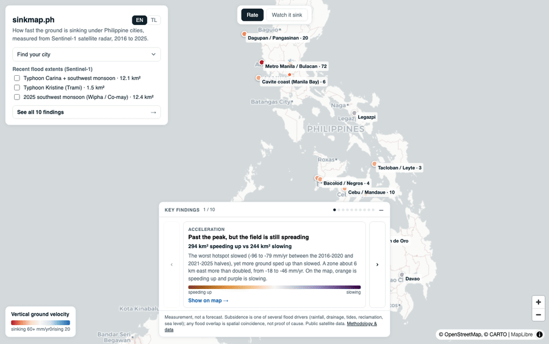
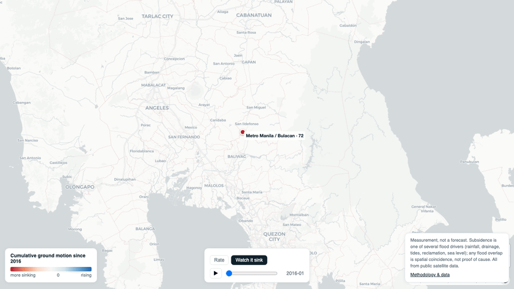

# sinkmap.ph

The measured record of how the ground under Philippine cities is sinking, built
from open satellite data, shown next to where the floods actually hit. It uses
Sentinel-1 InSAR time-series to map land-subsidence rate (mm/yr) over 2016-2026,
validates against published rates for Metro Manila and other metros, and
overlays recent flood extents to show where the sinking and the flooding line up.
Repository: sinkmap-ph.



*Real recording of the map: click a city for its measured rate, the published
reference, and its building exposure; toggle the recent flood extents.*

**Status: validated, with a working map.** The pipeline runs end to end and three
metros reproduce their published rates within a factor of two:

| City | Measured (2016-2025) | Published (Aslan 2024) |
| --- | --- | --- |
| Metro Manila / Bulacan | ~72 mm/yr | ~109 mm/yr |
| Cebu / Mandaue | ~10 mm/yr | 11 mm/yr |
| Iloilo | ~10 mm/yr | 9 mm/yr |

The fastest sinking in Metro Manila is inland in the Bulacan/Pampanga lowland
(around 15.18 deg N), consistent with the published maximum location, and it holds
up under a stable reference and a tropospheric correction. Cebu also shows a
localized faster-sinking cluster (~35 mm/yr) at the southern coast, consistent with
reclamation. Two cities (Legazpi, Davao) are **coherence-limited** over small
vegetated or upland areas and are reported as honest non-results, not forced
numbers; they would need persistent-scatterer InSAR or a tighter urban area.

Where the sinking ground meets flood-prone ground (NOAH 25-year hazard): in Metro
Manila 41% of high-subsidence ground is flood-prone against 8% of all measured
ground (about 5x); in Cebu 18% against 2% (about 9x); Iloilo shows no preferential
coincidence. Full write-ups in `docs/findings/`. The map is a single-file MapLibre
site with a velocity layer, a 2016-2025 "watch it sink" time slider, toggleable
flood extents, and a building-exposure read (OSM buildings on fast-sinking ground:
~1,900 in Metro Manila above 15 mm/yr, ~560 in Cebu, ~410 in Iloilo). `make serve`,
then `web/index.html`.

## What this measures

This measures **subsidence rate**: how fast the ground is moving down, in mm/yr,
from interferometric phase. It does not predict which buildings will flood, does
not assign blame, and issues no per-building verdict. Where the sinking ground
meets a flood is a question for engineers and hydrologists on the ground. The map
shows the rate and where recent floods reached.

Subsidence is one driver of flooding among rainfall, drainage, tides,
reclamation, and sea-level rise. The flood overlay is shown as observed spatial
coincidence, not as proof of cause.

## What's in this repo

- **`pipeline/insar/`**: the Phase 0 InSAR pipeline. `search.py` finds the
  Sentinel-1 SLC stack for an AOI from the ASF archive (public, no auth) and
  picks one coherent descending track, quarterly-subsampled. `submit_hyp3.py`
  builds a short-baseline (SBAS) pair network and submits it to ASF HyP3 for
  on-demand InSAR (needs an Earthdata login). `velocity.py` writes the MintPy
  config and converts the resulting line-of-sight velocity to pseudo-vertical
  via `cos(incidence)`. `validate.py` is the GO/NO-GO gate against the published
  anchor.
- **`pipeline/cities.json` + `pipeline/aoi.py`**: the AOI registry. The source of
  truth for each city's bbox, dry-run tier, physical regime, and the published
  subsidence rate used for validation.
- **`pipeline/flood/`**, **`pipeline/overlay/`**: the flood-extent derivation
  (Sentinel-1 in Earth Engine) and the subsidence x flood correlation (Phase 2).
- **`web/`**: the static MapLibre + PMTiles map (`serve.py` is Range-capable for
  local PMTiles).
- **`docs/planning/`**: the locked spec (`SCOPE.md`, `CITIES.md`,
  `METHOD-decomposition.md`, `BUILD-PROMPT.md`).

## What this is not

- Not a flood forecast or an evacuation tool. It is a slow-measurement map of
  ground motion, not a real-time warning.
- Not a per-building risk verdict. Subsidence rate is a regional field; what
  happens to any one structure is an engineering question.
- Not a damage map. It measures the ground moving, not buildings failing.
- Not a claim of cause. Subsidence coinciding with floods is shown as
  coincidence; rainfall, drainage, tides, and sea level all contribute.

## Method, in one line

Descending-track Sentinel-1 LOS velocity from an SBAS time-series, converted to
vertical under a stated vertical-dominant assumption (valid for aquifer, delta,
and reclamation subsidence). Full ascending+descending decomposition is reserved
for slope-motion cases. See `docs/planning/METHOD-decomposition.md`.

## Quickstart (Phase 0, runnable now)

```bash
make venv

# Verify the Sentinel-1 stack for an AOI (no credentials needed):
make search AOI=metro-manila

# Inspect the SBAS pair plan and credit footprint (no submission):
make dry-run AOI=metro-manila

# Submit to HyP3 (needs an Earthdata login in ~/.netrc):
.venv/bin/python -m pipeline.insar.submit_hyp3 --aoi metro-manila

# After MintPy produces a vertical velocity raster, run the gate:
make validate AOI=metro-manila VALUE=-105   # or RASTER=path/to/vertical.npy

make test
```

Build the web layers from the MintPy outputs and serve the map locally:

```bash
# render the velocity + sink-lapse PNGs and cities.json (MintPy env, has gdal):
~/anaconda3/envs/sinkmap-mintpy312/bin/python scripts/make_web_layers.py
# derive the flood-extent overlays (GEE, personal key):
SINKMAP_EE_KEY=~/Desktop/leaves-ph/.ee-key.json .venv/bin/python scripts/make_flood_layers.py

make serve   # Range-capable server on :8788, then open web/index.html
```



*Real recording of the map (`scripts/record_sink_lapse.py`): the Bulacan/Pampanga
hotspot accumulating ground motion across the decade.*

## Roadmap (honest "not yet")

- **Richer building exposure.** The current exposure read uses OSM footprints via
  Overpass; a complete count would use Microsoft / Google Open Buildings or Overture
  for PH (denser coverage than OSM in some areas).
- **Legazpi and Davao.** Coherence-limited under this areal SBAS method; would need
  persistent-scatterer InSAR or a tighter urban AOI.
- **Metro Manila coastal CAMANAVA.** The current grid covers the inland Bulacan belt;
  full coastal coverage needs additional southern Sentinel-1 frames.
- **Exploratory cities** (Dagupan, Butuan, Cotabato, and others with no published
  rate) and the **ascending+descending decomposition** remain future work.

## Data and responsible use

All inputs are publicly licensed (Copernicus Sentinel-1, NASA/ASF, ESA, JRC,
Project NOAH, Microsoft/Google/Overture building footprints). Code is MIT; derived
data is CC-BY-4.0. Full attribution in `NOTICE`.

> All data sourced from public records. sinkmap.ph computes statistical
> indicators only. Specific allegations, if any, require independent
> investigation and corroboration.
